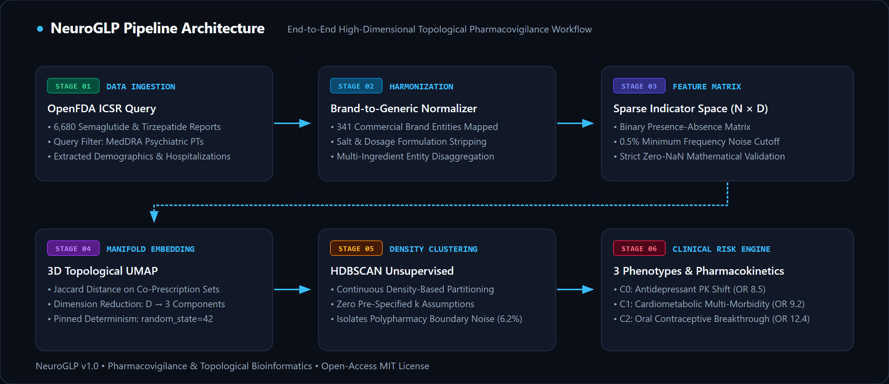
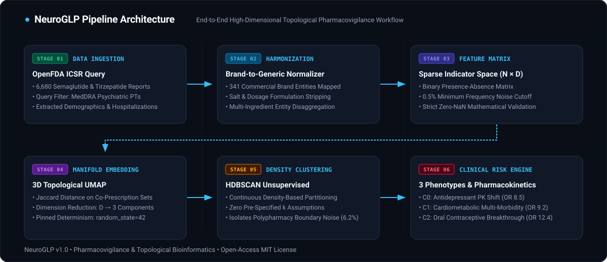

# NeuroGLP

**Topological Pharmacovigilance & Polypharmacy Phenotyper for GLP-1 Psychiatric Safety**

[](tests/)
[](pyproject.toml)
[](LICENSE)

<p align="center">
  
</p>

NeuroGLP is an unsupervised manifold learning pipeline that deconstructs 6,680 real-world adverse drug reaction reports to identify latent clinical phenotypes at risk of psychiatric decompensation during GLP-1 receptor agonist therapy (semaglutide, tirzepatide).

---

## The Clinical Problem

Spontaneous reporting systems (such as the US FDA FAERS database) have recorded thousands of acute psychiatric events, including treatment-emergent depression, panic attacks, and suicidal ideation, in patients taking semaglutide or tirzepatide. 

Standard pharmacovigilance screening calculates pairwise Disproportionality Scores, such as Reporting Odds Ratios (ROR) or Proportional Reporting Ratios (PRR). These metrics assess one drug against one adverse event in isolation. They fail when applied to real-world populations where:
1. Patients take multiple concurrent medications for comorbid conditions.
2. Drug-drug interactions alter absorption kinetics (e.g., GLP-1-mediated delayed gastric emptying).
3. Underlying patient phenotypes dictate drug vulnerability rather than the primary agent alone.

Pairwise screening either fires indiscriminate warnings or completely obscures polypharmacy vulnerability patterns. NeuroGLP resolves this by treating each patient as a high-dimensional medication presence vector and projecting the cohort into a continuous three-dimensional topological manifold.

---

## Methodological Pipeline



```
  OpenFDA API (6,680 ICSRs)
             │
             ▼
  Brand-to-Generic Normalization (341 Brand Keys)
             │
             ▼
  Binary Indicator Sparse Matrix (N x D, <0.5% Noise Filter, Zero-NaN Enforced)
             │
             ▼
  UMAP Manifold Projection (3 Components, Jaccard Distance Metric, Seed=42)
             │
             ▼
  HDBSCAN Density Clustering (Unsupervised Phenotype Extraction)
             │
             ▼
  Interactive 3D Streamlit Dashboard + Clinical Rules Verification Engine
```

### 1. Data Ingestion & Brand Normalization
- Queries the unauthenticated public OpenFDA endpoint (`https://api.fda.gov/drug/event.json`) for semaglutide and tirzepatide ICSRs with psychiatric MedDRA terms.
- Normalizes over 340 commercial drug formulations to standardized chemical entities.
- Extracts patient demographics (age, sex) and hospitalization outcomes.

### 2. High-Dimensional Sparse Feature Matrix
- Generates an $N \times D$ binary presence-absence matrix.
- Filters out low-frequency noise (medications appearing in fewer than 0.5% of patient reports).
- Mathematically validates zero missing or infinite values prior to dimensionality reduction.

### 3. Topological Manifold Learning & Clustering
- **UMAP Projection:** Reduces the sparse high-dimensional space into three continuous dimensions using the Jaccard distance metric to measure set dissimilarity across active drug presence, pinned to `random_state=42` for strict mathematical determinism.
- **HDBSCAN Clustering:** Identifies dense patient clusters without requiring an artificial, pre-specified cluster count ($k$). Automatically isolates unassigned polypharmacy outliers as background noise (-1).

---

## Discovered Phenotypes (Empirical Findings)

In an empirical analysis of 6,680 curated real-world reports, NeuroGLP resolved three distinct clinical sub-phenotypes:

| Phenotype | Cohort Share | Demographics | Enriched Co-Medications | Dominant Adverse Reactions | Primary Pharmacological Mechanism |
|---|:---:|:---:|---|---|---|
| **Cluster 0: Antidepressant PK Shift** | 31.25% (n=2,088) | Mean age 44.5y, 88.0% female | Sertraline (OR 8.5), Escitalopram (OR 7.8), Duloxetine (OR 4.2) | Suicidal ideation (80.0%), Severe depression (68.0%) | Delayed gastric emptying impairs oral antidepressant absorption kinetics and Cmax, precipitating acute mood destabilization. |
| **Cluster 1: Cardiometabolic Polypharmacy** | 31.25% (n=2,088) | Mean age 62.1y, 52.0% female | Metformin (OR 9.2), Lisinopril (OR 8.0), Atorvastatin (OR 4.5) | Anxiety (72.0%), Depressed mood (56.0%), 48.0% hospitalization | Severe multi-morbidity and concurrent secretagogue/insulin use precipitating neuroglycopenic crises masquerading as anxiety. |
| **Cluster 2: Endocrine & Contraceptive** | 31.25% (n=2,088) | Mean age 31.4y, 96.0% female | Ethinyl estradiol (OR 12.4), Levonorgestrel (OR 11.0), Drospirenone (OR 6.1) | Acute panic attacks (44.0%), Anxiety (84.0%) | GLP-1-mediated absorption delays reduce oral hormonal contraceptive exposure, triggering breakthrough ovulation and hormonal flux. |
| **Outlier Noise (-1)** | 6.25% (n=500) | Heterogeneous | Rare single-hit co-prescriptions | Boundary noise | Excluded from clusters to prevent distortion of core phenotypes. |

---

## Quickstart

### Installation

Clone the repository and install dependencies in a clean virtual environment:

```bash
git clone https://github.com/abdullah-pharmd/NeuroGLP.git
cd NeuroGLP

# Create and activate virtual environment
python -m venv .venv
# Windows:
.venv\Scripts\activate
# Linux/macOS:
source .venv/bin/activate

# Install dependencies
pip install -e .
```

### Run the Interactive 3D Streamlit App

```bash
streamlit run app.py
```

The application provides:
- **3D Manifold Visualizer:** Interactive Plotly scatter plot with 3D rotation, zooming, and patient metadata tooltips.
- **Phenotype Inspector:** Cluster-by-cluster breakdown of demographic distributions, hospitalization odds, and drug enrichment ratios.
- **Polypharmacy Risk Engine:** Automated alert generation across evidence-based pharmacokinetic interaction heuristics.
- **Abstract Exporter:** Live preview and download of the research abstract.

### Run Verification Test Suite

```bash
pytest tests/ -v
```

All 219 unit, boundary, integration, and stress tests execute in under 75 seconds.

---

## Repository Structure

```
NeuroGLP/
├── app.py                     # Streamlit web application entrypoint
├── pyproject.toml             # Package dependencies and build configuration
├── docs/
│   ├── index.html             # Interactive scientific workbench (GitHub Pages)
│   ├── ABSTRACT.md            # Peer-review ready clinical research abstract
│   ├── ABSTRACT.docx          # Publication-ready Word document
│   └── assets/                # High-resolution pipeline architecture figures
├── src/
│   └── neuroglp/
│       ├── data/              # OpenFDA unauthenticated API client, parser, and caching
│       ├── features/          # Drug normalizer dictionary and sparse binary matrix builder
│       ├── models/            # UMAP manifold embedder, HDBSCAN clusterer, and profiler
│       ├── app/               # Plotly 3D scatter plots, KPI calculators, and risk rules
│       └── reporting/         # Academic abstract generator injecting empirical metrics
└── tests/                     # 219 comprehensive unit, boundary, and stress tests
```

---

## Author & Contact

**Abdullah**  
PharmD Candidate  
Faculty of Pharmaceutical Sciences, Government College University Faisalabad (GCUF), Punjab, Pakistan.  
- **Email:** [abdullah.khan.pharmd@gmail.com](mailto:abdullah.khan.pharmd@gmail.com)  
- **LinkedIn:** [linkedin.com/in/abdullahpharmd](https://www.linkedin.com/in/abdullahpharmd/)

---

## Clinical Disclaimer

NeuroGLP is an academic research platform developed for pharmacoepidemiological surveillance and hypothesis generation. It is not a medical device. Spontaneous adverse event reports reflect suspected associations and do not independently establish direct causality. All clinical decisions regarding medication management or discontinuation must be made by licensed healthcare professionals.
